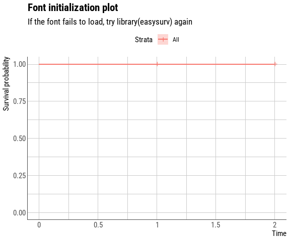

<!-- README.md is generated from README.Rmd. Please edit that file -->

```{r setup, include=FALSE}
knitr::opts_chunk$set(
  collapse = TRUE,
  comment = "#>", fig.path = "man/figures/"
)

library(easysurv)
```

# easysurv <a href="https://maple-health-group.github.io/easysurv/"></a>

<!-- badges: start -->
[](https://github.com/Maple-Health-Group/easysurv/actions/workflows/check-standard.yaml)
[](https://github.com/Maple-Health-Group/easysurv/actions/workflows/test-coverage.yaml)
<!-- badges: end -->

## Overview

The *easysurv* R package provides tools to estimate and inspect parametric survival models. 

The package is built upon the *flexsurv* engine, and aims to provide a helpful starting point to explore survival extrapolations across frequently used distributions (such as exponential, generalized gamma, gamma, Gompertz, log-logistic, log-normal and Weibull).

## Installation

If you haven't already, install [R](https://www.r-project.org) and consider using [RStudio](https://www.rstudio.com/) as your integrated development environment (IDE).


```{r install, eval = FALSE}
# You will need to have the pak package installed.
install.packages("pak")

# Then, you can install easysurv with the following line of code.
pak::pkg_install("Maple-Health-Group/easysurv")
```

## Getting Started

```{r getting-started, eval = FALSE}
# Load the easysurv library
library(easysurv)

# Open an example script
quick_start()
## Note: The default file name is "easysurv_start.R", but you can define your own, e.g.
## quick_start("my_file_name.R")

# Access help files
help(package = "easysurv")

# Access a detailed vignette
browseVignettes("easysurv")
```


## Example

The package contains a family of functions prefixed with "quick_" that enable a comprehensive set of analyses in just a few simple steps.

For example, the `quick_KM()` function can generate themed KM plots, accompanied by pertinent statistics such as numbers at risk over time.

```{r quick-KM, warning=FALSE, message=FALSE, fig.width=6, fig.height=5, fig.showtext = TRUE}
# Format the pre-loaded "lung" dataset so that the "status" (1/2) variable can serve as an event indicator (0/1)
surv_data <- easy_lung |>
  dplyr::mutate(event = status - 1)

# Run "quick_KM()" on this formatted dataset
KM_quick <- easysurv::quick_KM(
  data = surv_data,
  time = "time",
  event = "event",
  strata = "sex",
  strata_labels = c("Male", "Female"))

# Print the newly created KM plot
KM_quick[["KM_plot"]]
```

For a user-defined set of distributions, the `quick_fit()` function can check distribution convergence, generate plots for extrapolations and smoothed hazards, create survival parameter tables, show goodness-of-fit statistics, and calculate average survival times.

```{r quick-fit, warning=FALSE, message=FALSE, fig.width=6, fig.height=5, fig.showtext = TRUE}
# Run "quick_fit()" on the formatted "lung" dataset, examining the effect of the "sex" variable
fit_quick <- easysurv::quick_fit(
  data = surv_data,
  time = "time",
  event = "event",
  strata = "sex",
  dists = c("exp", "gamma", "gengamma", "gompertz", "llogis", "lnorm", "weibull"),
  strata_labels = c("Male", "Female"),
  add_interactive_plots = TRUE)

# Print the hazard and fitted survival plots
fit_quick[["hazard_plots"]][["Male"]]
fit_quick[["fit_plots"]][["Male"]]
# Print the AIC/BIC scores and their relative ranking
fit_quick[["goodness_of_fit"]][["Male"]]

```

## Known Issues

#### Fonts
In many cases, changing fonts in R plots can be more challenging than it should be. The standard plots produced in easysurv use the Roboto Condensed font. R attempts to load the font when calling library(easysurv). You should see the following initialization plot at start-up:

<!-- -->

If the font does not display correctly. We recommend calling library(easysurv) again. If the font displays as expected, disregard font-related warnings R may display.
If you want to show easysurv plots in an R Markdown file, consider adding fig.showtext = TRUE to the code chunk options to avoid font size issues.

## Future Tasks

* Expand test framework with increased coverage.
* Expand diagnostic test capabilities with additional outputs and plots.
* Create additional vignettes for other workflows (e.g., mixture cure analysis, spline analysis).
