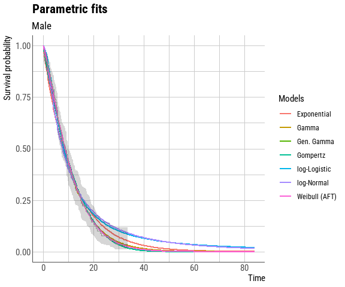
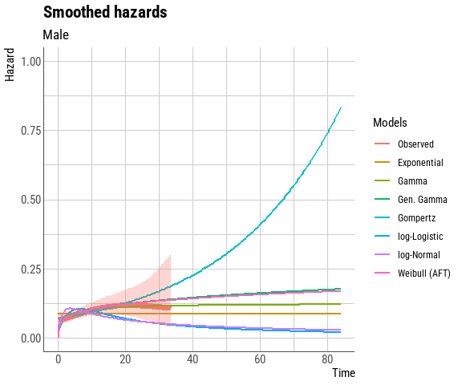

<!-- README.md is generated from README.Rmd. Please edit that file -->

# easysurv

<!-- badges: start -->

[](https://github.com/Maple-Health-Group/easysurv/actions/workflows/check-standard.yaml)
[](https://github.com/Maple-Health-Group/easysurv/actions/workflows/test-coverage.yaml)
<!-- badges: end -->

## Overview

The *easysurv* R package provides tools to estimate and inspect
parametric survival models.

The package is built upon the *flexsurv* engine, and aims to provide a
helpful starting point to explore survival extrapolations across
frequently used distributions (such as exponential, generalized gamma,
gamma, Gompertz, log-logistic, log-normal and Weibull).

The package contains a family of functions prefixed with “quick\_” that
enable a comprehensive set of analyses in just a few simple steps.

For example, the quick_KM() function can generate themed KM plots,
accompanied by pertinent statistics such as numbers at risk over time.

``` r
surv_data <- easy_lung |>
  dplyr::mutate(event = status - 1)

KM_quick <- easysurv::quick_KM(
  data = surv_data,
  time = "time",
  event = "event",
  strata = "sex",
  strata_labels = c("Male", "Female"))

KM_quick[["KM_plot"]]
```

<!-- -->

For a user-defined set of distributions, the quick_fit() function can
check distribution convergence, generate plots for extrapolations and
smoothed hazards, create survival parameter tables, show goodness-of-fit
statistics, and calculate average survival times.

``` r
fit_quick <- easysurv::quick_fit(
  data = surv_data,
  time = "time",
  event = "event",
  strata = "sex",
  dists = c("exp", "gamma", "gengamma", "gompertz", "llogis", "lnorm", "weibull"),
  strata_labels = c("Male", "Female"),
  add_interactive_plots = TRUE)

fit_quick[["fit_plots"]][["Male"]]
```

<!-- -->

``` r
fit_quick[["hazard_plots"]][["Male"]]
```

<!-- -->

``` r
fit_quick[["goodness_of_fit"]][["Male"]]
#>           model      AIC      BIC AIC_rank BIC_rank
#> 1   Exponential 772.4134 775.3406        5        3
#> 2         Gamma 767.6859 773.5404        2        2
#> 3    Gen. Gamma 769.2226 778.0044        3        5
#> 4      Gompertz 769.7047 775.5592        4        4
#> 5  log-Logistic 776.5899 782.4444        6        6
#> 6    log-Normal 784.6606 790.5151        7        7
#> 7 Weibull (AFT) 767.2281 773.0826        1        1
```

## Installation

If you haven’t already, install [R](https://www.r-project.org) and
consider using [RStudio](https://www.rstudio.com/) as your integrated
development environment (IDE).

``` r
# You will need to have the pak package installed.
install.packages("pak")

# Then, you can install easysurv with the following line of code.
pak::pkg_install("Maple-Health-Group/easysurv")
```

## Getting Started

``` r
# Load the easysurv library
library(easysurv)

# Open an example script
quick_start()
## Note: The default file name is "easysurv_start.R", but you can define your own, e.g.
## quick_start("my_file_name.R")

# Access help files
help(package = "easysurv")

# Access a detailed vignette
browseVignettes("easysurv")
```
