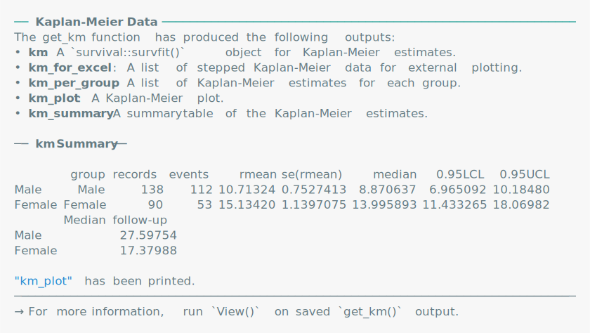
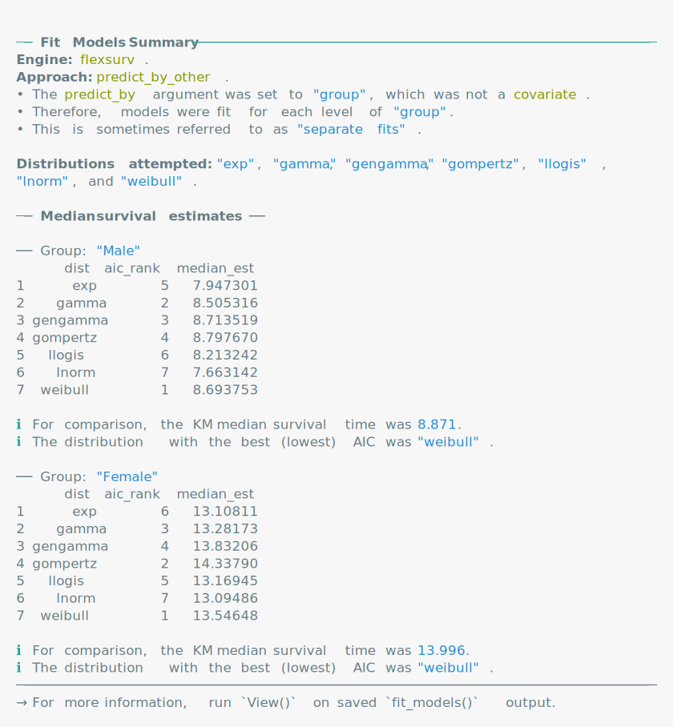

<!-- README.md is generated from README.Rmd. Please edit that file -->

# easysurv <a href="https://maple-health-group.github.io/easysurv/"></a>

<!-- badges: start -->

[](https://github.com/Maple-Health-Group/easysurv/actions/workflows/check-standard.yaml)
[](https://github.com/Maple-Health-Group/easysurv/actions/workflows/test-coverage.yaml)
<!-- badges: end -->

The *easysurv* R package provides tools to simplify survival data
analysis and model fitting.

*easysurv* facilitates plotting Kaplan-Meier curves, assessing the
proportional hazards assumption, estimating parametric survival models
using engines such as `flexsurv`, `flexsurvspline`, `flexsurvcure` and
`survival`, and exporting associated analyses to Excel.

By default, the package uses the `flexsurv` engine and provides a
helpful starting point to explore survival extrapolations across
frequently used distributions (such as exponential, generalized gamma,
gamma, Gompertz, log-logistic, log-normal and Weibull).

## Installation

If you haven’t already, install [R](https://www.r-project.org) and
consider using [RStudio](https://posit.co/download/rstudio-desktop/) as
your integrated development environment (IDE).

``` r
# You will need to have the pak package installed.
install.packages("pak")

# Then, install easysurv with the following line of code.
pak::pkg_install("Maple-Health-Group/easysurv")
```

## Getting started

``` r
# Attach the easysurv library
library(easysurv)

# Open an example script
quick_start()
## Note: The default file name is "easysurv_start.R", but you can define your own, e.g.
## quick_start("my_file_name.R")

# Access help files
help(package = "easysurv")
```

## Examples

### Start by tidying your data…

``` r
# Load the easy_lung data from the easysurv package
# Recode the "status" variable to create an event indicator (0/1)
surv_data <- easy_lung |>
  dplyr::mutate(
    time = time,
    event = status - 1,
    group = sex
  )

# Make the group variable a factor and assign level labels.
surv_data <- surv_data |>
  dplyr::mutate_at("group", as.factor)
levels(surv_data$group) <- c("Male", "Female")
```

### … then enjoy the easysurv functions!

### `inspect_surv_data()`

``` r
inspect_surv_data(
  data = surv_data,
  time = "time",
  event = "event",
  group = "group"
)
```

<picture>
<source media="(prefers-color-scheme: dark)" srcset="man/figures//inspect-a-dark.svg">
 </picture>

### `get_km()`

``` r
km_check <- get_km(
  data = surv_data,
  time = "time",
  event = "event",
  group = "group"
)

print(km_check)
```


<picture>
<source media="(prefers-color-scheme: dark)" srcset="man/figures//get-KM-a-dark.svg">
 </picture>

### `test_ph()`

``` r
ph_check <- test_ph(
  data = surv_data,
  time = "time",
  event = "event",
  group = "group"
)

print(ph_check)
```


<picture>
<source media="(prefers-color-scheme: dark)" srcset="man/figures//test-PH-a-dark.svg">
 </picture>

### `fit_models()`

``` r
separate_models <- fit_models(
  data = surv_data,
  time = "time",
  event = "event",
  predict_by = "group"
)

print(separate_models)
```

<picture>
<source media="(prefers-color-scheme: dark)" srcset="man/figures//fit-models-a-dark.svg">
 </picture>

### `predict_and_plot()`

``` r
plots <- predict_and_plot(
  fit_models = separate_models,
  data = surv_data
)

print(plots)
```


<picture>
<source media="(prefers-color-scheme: dark)" srcset="man/figures//plot-models-a-dark.svg">
 </picture>
