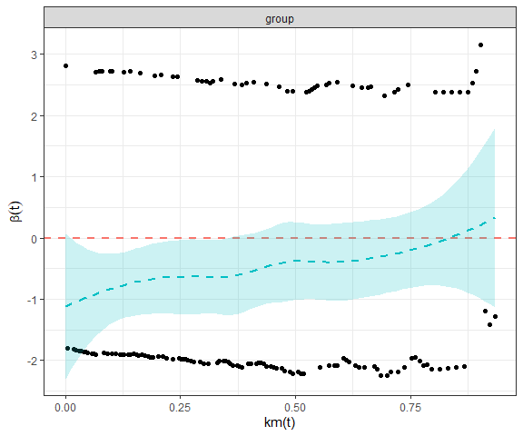
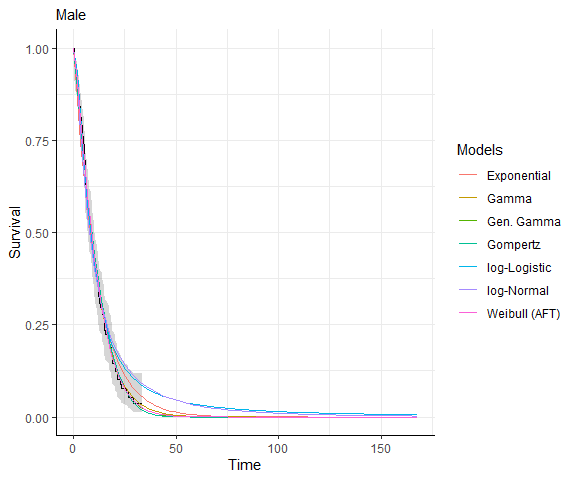
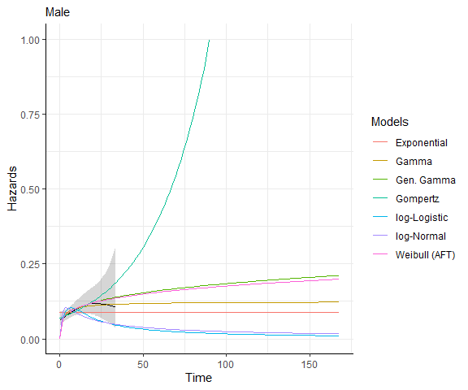
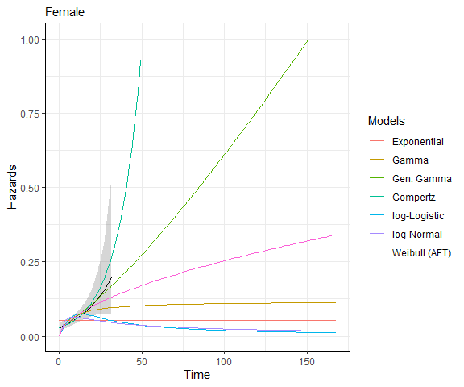

<!-- README.md is generated from README.Rmd. Please edit that file -->

# <b>easysurv</b> <a href="https://maple-health-group.github.io/easysurv/"></a>

<!-- badges: start -->

[](https://github.com/Maple-Health-Group/easysurv/actions/workflows/check-standard.yaml)
[](https://github.com/Maple-Health-Group/easysurv/actions/workflows/test-coverage.yaml)
<!-- badges: end -->

The *easysurv* R package provides tools to simplify survival data
analysis and model fitting.

*easysurv* facilitates plotting Kaplan-Meier curves, assessing the
proportional hazards assumption, estimating parametric survival models
using engines such as `flexsurv`, `flexsurvspline`, `flexsurvcure` and
`survival`, and exporting associated analyses to Excel.

By default, the package uses the `flexsurv` engine and provides a
helpful starting point to explore survival extrapolations across
frequently used distributions (such as exponential, generalized gamma,
gamma, Gompertz, log-logistic, log-normal and Weibull).

## Installation

If you haven’t already, install [R](https://www.r-project.org) and
consider using [RStudio](https://posit.co/download/rstudio-desktop/) as
your integrated development environment (IDE).

<div id="install" class="chunk">

<div class="rcode">

``` r
# You will need to have the pak package installed.
install.packages("pak")

# Then, you can install easysurv with the following line of code.
pak::pkg_install("Maple-Health-Group/easysurv")
```

</div>

</div>

## Getting started

<div id="getting-started" class="chunk">

<div class="rcode">

``` r
# Attach the easysurv library
library(easysurv)

# Open an example script
quick_start()
## Note: The default file name is "easysurv_start.R", but you can define your own, e.g.
## quick_start("my_file_name.R")

# Access help files
help(package = "easysurv")
```

</div>

</div>

## Examples

### Start by tidying your data

<div id="tidy-data" class="chunk">

<div class="rcode">

``` r
# Load the easy_lung data from the easysurv package
# Recode the "status" variable to create an event indicator (0/1)
surv_data <- easy_lung |>
  dplyr::mutate(
    time = time,
    event = status - 1,
    group = sex
  )

# Make the group variable a factor and assign level labels.
surv_data <- surv_data |>
  dplyr::mutate_at("group", as.factor)
levels(surv_data$group) <- c("Male", "Female")
```

</div>

</div>

### `get_km()`

<!--
<div class="chunk" id="collapse_cli"><div class="rcode"><style type="text/css">
pre.r-output {
 margin-bottom: 0 !important;
 padding: 0px 16px;
}
&#10;</style>
</div></div>
-->

``` r
km_check <- get_km(
  data = surv_data,
  time = "time",
  event = "event",
  group = "group"
)

print(km_check)
```

<!-- -->
<pre class="r-output"><code>
<span style='color: #00BBBB;'>──</span> <span style='font-weight: bold;'>Kaplan-Meier Data</span> <span style='color: #00BBBB;'>───────────────────────────────────────────────────────────</span>
The get_km function has produced the following outputs:
• <span style='font-weight: bold;'>km</span>: A `survival::survfit()` object for Kaplan-Meier estimates.
• <span style='font-weight: bold;'>km_for_excel</span>: A list of stepped Kaplan-Meier data for external plotting.
• <span style='font-weight: bold;'>km_per_group</span>: A list of Kaplan-Meier estimates for each group.
• <span style='font-weight: bold;'>km_plot</span>: A Kaplan-Meier plot.
• <span style='font-weight: bold;'>km_summary</span>: A summary table of the Kaplan-Meier estimates.
&#10;── <span style='font-weight: bold;'>km Summary</span> ──
&#10;        group records events    rmean se(rmean)    median   0.95LCL  0.95UCL
Male     Male     138    112 10.71324 0.7527413  8.870637  6.965092 10.18480
Female Female      90     53 15.13420 1.1397075 13.995893 11.433265 18.06982
       Median follow-up
Male           27.59754
Female         17.37988
────────────────────────────────────────────────────────────────────────────────
The km_plot has been printed.
→ For more information, run `View()` on saved get_km output.
</code></pre>

### `test_ph()`

``` r
ph_check <- test_ph(
  data = surv_data,
  time = "time",
  event = "event",
  group = "group"
)

print(ph_check)
```

<!-- --><!-- -->
<pre class="r-output"><code>
<span style='color: #00BBBB;'>──</span> <span style='font-weight: bold;'>Proportional Hazards Assumption Testing</span> <span style='color: #00BBBB;'>─────────────────────────────────────</span>
&#10;── <span style='font-weight: bold;'>Cox Proportional Hazards Model</span> ──
&#10;The coefficients from `survival::coxph()` are:
&#10;                  coef exp(coef)  se(coef)         z    Pr(>|z|)
groupFemale -0.5310235 0.5880028 0.1671786 -3.176385 0.001491229
The exp(coef) column shows the hazard ratio was <span style='color: #0000BB;'>0.588</span>.
&#10;── <span style='font-weight: bold;'>Test Survival Curve Differences</span> ──
&#10;<span style='color: #00BBBB;'>ℹ</span> `survival::survdiff()` uses a log-rank test to test for differences in survival curves between groups.
<span style='color: #00BBBB;'>ℹ</span> The null hypothesis is that the survival curves are the same.
<span style='color: #00BB00;'>✔</span> The test suggests that survival differences between groups <span style='font-weight: bold;'>ARE</span> statistically significant.
<span style='color: #00BB00;'>✔</span> p-value: <span style='color: #0000BB;'>0.001</span>.
&#10;── <span style='font-weight: bold;'>Test the Proportional Hazards Assumption of a Cox Regression</span> ──
&#10;<span style='color: #00BBBB;'>ℹ</span> `survival::cox.zph()` tests the proportional hazards assumption.
<span style='color: #00BBBB;'>ℹ</span> The null hypothesis is that the hazards are proportional.
<span style='color: #00BB00;'>✔</span> The global test suggests that the PH assumption <span style='font-weight: bold;'>MAY BE</span> valid.
<span style='color: #00BB00;'>✔</span> p-value: <span style='color: #0000BB;'>0.091</span>.
&#10;                p
group  0.09062506
GLOBAL 0.09062506
&#10;── <span style='font-weight: bold;'>Plots</span> ──
&#10;The Schoenfeld residuals and log cumulative hazard plots have been printed.
── Schoenfeld residual plot 
<span style='color: #00BBBB;'>ℹ</span> A <span style='font-weight: bold;'>flat smoothed line</span> close to zero supports the PH assumption.
<span style='color: #00BBBB;'>ℹ</span> A <span style='font-weight: bold;'>non-flat smoothed line</span> with a trend suggests the PH assumption is violated.
&#10;── Log cumulative hazard plot 
<span style='color: #00BBBB;'>ℹ</span> <span style='font-weight: bold;'>Parallel Lines:</span> If the lines are roughly parallel, this suggests that the proportional hazards assumption holds.
Parallel lines indicate that the hazard ratios between groups are consistent
over time.
<span style='color: #00BBBB;'>ℹ</span> <span style='font-weight: bold;'>Non-Parallel Lines:</span> If the lines are not parallel and diverge or converge, the PH assumption may be violated. 
Non-parallel lines indicate that the hazard ratios between groups change over
time.
────────────────────────────────────────────────────────────────────────────────
<span style='color: #00BBBB;'>ℹ</span> PH tests may not always agree, so it is important to consider the results of all tests and plots.
<span style='color: #00BBBB;'>ℹ</span> The full object can be inspected by running `View()` on saved test_ph output.
</code></pre>

### `fit_models()`

``` r
separate_models <- fit_models(
  data = surv_data,
  time = "time",
  event = "event",
  predict_by = "group"
)

print(separate_models)
```

<pre class="r-output"><code>
<span style='color: #00BBBB;'>──</span> <span style='font-weight: bold;'>Fit Models Summary</span> <span style='color: #00BBBB;'>──────────────────────────────────────────────────────────</span>
<span style='font-weight: bold;'>Engine:</span> <span style='color: #00BB00;'>flexsurv</span>.
<span style='font-weight: bold;'>Approach:</span> <span style='color: #00BB00;'>predict_by_other</span>.
• The <span style='color: #00BB00;'>predict_by</span> argument was set to <span style='color: #0000BB;'>"group"</span>, which was not a <span style='color: #00BB00;'>covariate</span>.
• Therefore, models were fit for each level of <span style='color: #0000BB;'>"group"</span>.
• This is sometimes referred to as <span style='color: #0000BB;'>"separate fits"</span>.
<span style='font-weight: bold;'>Distributions attempted:</span> <span style='color: #0000BB;'>"exp"</span>, <span style='color: #0000BB;'>"gamma"</span>, <span style='color: #0000BB;'>"gengamma"</span>, <span style='color: #0000BB;'>"gompertz"</span>, <span style='color: #0000BB;'>"llogis"</span>,
<span style='color: #0000BB;'>"lnorm"</span>, and <span style='color: #0000BB;'>"weibull"</span>.
&#10;── <span style='font-weight: bold;'>Median survival estimates</span> ──
&#10;── Group: <span style='color: #0000BB;'>"Male"</span> 
      dist aic_rank median_est
1      exp        5   7.947301
2    gamma        2   8.505316
3 gengamma        3   8.713519
4 gompertz        4   8.797670
5   llogis        6   8.213242
6    lnorm        7   7.663142
7  weibull        1   8.693753
<span style='color: #00BBBB;'>ℹ</span> For comparison, the KM median survival time was <span style='color: #0000BB;'>8.871</span>.
<span style='color: #00BBBB;'>ℹ</span> The distribution with the best (lowest) AIC was <span style='color: #0000BB;'>"weibull"</span>.
&#10;── Group: <span style='color: #0000BB;'>"Female"</span> 
      dist aic_rank median_est
1      exp        6   13.10811
2    gamma        3   13.28173
3 gengamma        4   13.83206
4 gompertz        2   14.33790
5   llogis        5   13.16945
6    lnorm        7   13.09486
7  weibull        1   13.54648
<span style='color: #00BBBB;'>ℹ</span> For comparison, the KM median survival time was <span style='color: #0000BB;'>13.996</span>.
<span style='color: #00BBBB;'>ℹ</span> The distribution with the best (lowest) AIC was <span style='color: #0000BB;'>"weibull"</span>.
────────────────────────────────────────────────────────────────────────────────
→ For more information, run `View()` on the fit_models output.
</code></pre>

### `predict_and_plot()`

``` r
plots <- predict_and_plot(
  fit_models = separate_models,
  data = surv_data
)

print(plots)
```

<!-- --><!-- --><!-- --><!-- -->

<pre class="r-output"><code><span style='color: #00BBBB;'>ℹ</span> Survival predictions are stored in the prediction list, namely under 'table_pred_surv'
<span style='color: #00BBBB;'>ℹ</span> The following plots have been printed.
$Male
$Male$surv_plots
&#10;$Male$hazard_plots
&#10;
$Female
$Female$surv_plots
&#10;$Female$hazard_plots
</code></pre>
