# Explore easysurv

## Introduction

Welcome to `easysurv`, an R package developed by the Maple Health Group
to support basic survival analysis.

This vignette will guide you through the basic functionalities of the
package.

## Installation

``` r

# First install 'pak' if you haven't already.
install.packages("pak")

# Then, install easysurv either from GitHub for the latest version:
pak::pkg_install("Maple-Health-Group/easysurv")

# Or from CRAN for the latest stable version:
pak::pkg_install("easysurv")
```

## Loading the package

``` r

# Start from a clean environment
rm(list = ls())

# Attach the easysurv package
library(easysurv)

# (Optional) load an easysurv analysis template
quick_start()
```

[`quick_start()`](https://maple-health-group.github.io/easysurv/reference/quick_start.md)
creates a new .R script, pre-loaded with code for survival analysis
using the `easy_lung` data set. `easy_lung` is a formatted copy of the
`lung` data set from the `survival` package.

[`quick_start2()`](https://maple-health-group.github.io/easysurv/reference/quick_start2.md)
and
[`quick_start3()`](https://maple-health-group.github.io/easysurv/reference/quick_start3.md)
create similar .R scripts based on other data sets. These include
`easy_bc` (“bc” from the `flexsurv` package) and `easy_adtte` (“adtte”
from the `ggsurvfit` package).

The choice of starting data introduces some variations in code structure
and function calls.

## Preparing your data

Below, we advise some practices to ensure that `easysurv` can handle
your data.

### Data import

`easysurv` is designed to work with data frames.

Here are some packages & their functions you might use to import your
survival data:

- `haven::read_sas()` for SAS (.sas7bdat) files
- `haven::read_dta()` for Stata (.dta) files
- `haven::read_sav()` for SPSS (.sav) files
- `readxl::read_excel()` for Excel (.xls & .xlsx) files
- `readr::read_csv()` for .csv files

We’re going to use `easy_adtte` as an example data set. Since it’s data
that comes loaded with `easysurv`, we don’t need any of the above
functions.

``` r

surv_data <- easy_adtte

surv_data
#> # A tibble: 2,199 × 19
#>    STUDYID   SUBJID USUBJID   AGE STR01 STR01N STR01L STR02 STR02N STR02L TRT01P
#>    <chr>      <dbl> <chr>   <dbl> <chr>  <dbl> <chr>  <chr>  <dbl> <chr>  <chr> 
#>  1 PSIVISSI…      1 PSIVIS…    78 Posi…      1 Hormo… NO P…      2 No pr… visma…
#>  2 PSIVISSI…      2 PSIVIS…    77 Posi…      1 Hormo… NO P…      2 No pr… table…
#>  3 PSIVISSI…      3 PSIVIS…    61 Posi…      1 Hormo… NO P…      2 No pr… table…
#>  4 PSIVISSI…      4 PSIVIS…    67 Nega…      2 Hormo… NO P…      2 No pr… table…
#>  5 PSIVISSI…      5 PSIVIS…    55 Posi…      1 Hormo… NO P…      2 No pr… visma…
#>  6 PSIVISSI…      6 PSIVIS…    70 Nega…      2 Hormo… NO P…      2 No pr… table…
#>  7 PSIVISSI…      7 PSIVIS…    54 Posi…      1 Hormo… NO P…      2 No pr… visma…
#>  8 PSIVISSI…      8 PSIVIS…    62 Nega…      2 Hormo… PRIO…      1 Prior… table…
#>  9 PSIVISSI…      9 PSIVIS…    61 Posi…      1 Hormo… NO P…      2 No pr… table…
#> 10 PSIVISSI…     10 PSIVIS…    65 Posi…      1 Hormo… NO P…      2 No pr… visma…
#> # ℹ 2,189 more rows
#> # ℹ 8 more variables: TRT01PN <dbl>, PARAM <chr>, PARAMCD <chr>, AVAL <dbl>,
#> #   CNSR <dbl>, EVNTDESC <chr>, CNSDTDSC <chr>, DCTREAS <chr>
```

### Data structure

`easysurv` expects your data to have the following structure:

- A column for `time` (time to event or censoring).
- A column for `event` status (1 for event, 0 for censored).
  - Be mindful that the event indicator in ADTTE data sets is named
    “CNSR” and is coded in the opposite way that R survival packages
    expect.
  - Therefore, you may need to recode the event indicator in ADTTE data
    sets.
- An optional column for `group` (for stratified analysis).

`easysurv` does not require you to use certain column names, although
consistency is encouraged.

``` r

surv_data <- surv_data |>
  dplyr::filter(PARAMCD == "PFS") |> # Filtering may be relevant for your data
  dplyr::mutate(
    time = AVAL,
    event = 1 - CNSR, # Recode status to 0 = censored, 1 = event
    group = TRT01P
  ) |>
  dplyr::mutate_at("group", as.factor) |> # Convert to factor for easier stratification
  dplyr::as_tibble() # Convert to tibble for easier viewing

surv_data
#> # A tibble: 2,199 × 22
#>    STUDYID   SUBJID USUBJID   AGE STR01 STR01N STR01L STR02 STR02N STR02L TRT01P
#>    <chr>      <dbl> <chr>   <dbl> <chr>  <dbl> <chr>  <chr>  <dbl> <chr>  <chr> 
#>  1 PSIVISSI…      1 PSIVIS…    78 Posi…      1 Hormo… NO P…      2 No pr… visma…
#>  2 PSIVISSI…      2 PSIVIS…    77 Posi…      1 Hormo… NO P…      2 No pr… table…
#>  3 PSIVISSI…      3 PSIVIS…    61 Posi…      1 Hormo… NO P…      2 No pr… table…
#>  4 PSIVISSI…      4 PSIVIS…    67 Nega…      2 Hormo… NO P…      2 No pr… table…
#>  5 PSIVISSI…      5 PSIVIS…    55 Posi…      1 Hormo… NO P…      2 No pr… visma…
#>  6 PSIVISSI…      6 PSIVIS…    70 Nega…      2 Hormo… NO P…      2 No pr… table…
#>  7 PSIVISSI…      7 PSIVIS…    54 Posi…      1 Hormo… NO P…      2 No pr… visma…
#>  8 PSIVISSI…      8 PSIVIS…    62 Nega…      2 Hormo… PRIO…      1 Prior… table…
#>  9 PSIVISSI…      9 PSIVIS…    61 Posi…      1 Hormo… NO P…      2 No pr… table…
#> 10 PSIVISSI…     10 PSIVIS…    65 Posi…      1 Hormo… NO P…      2 No pr… visma…
#> # ℹ 2,189 more rows
#> # ℹ 11 more variables: TRT01PN <dbl>, PARAM <chr>, PARAMCD <chr>, AVAL <dbl>,
#> #   CNSR <dbl>, EVNTDESC <chr>, CNSDTDSC <chr>, DCTREAS <chr>, time <dbl>,
#> #   event <dbl>, group <fct>
```

### Data labelling

`easysurv` can handle data with or without labels. However, labelled
data is easier to interpret.

``` r

# Check labels impacted by re-coding
attr(surv_data$event, "label")
#> [1] "Censoring flag (0 = Event, 1 = censored)"
# Check levels of the group factor variable
levels(surv_data$group)
#> [1] "tablemab + vismab 52 weeks"           
#> [2] "tablemab x 12 week -> vismab 34 weeks"
#> [3] "tablemab x 52 weeks"                  
#> [4] "vismab x 52 weeks"
# Overwrite the attributes with new labels
attr(surv_data$event, "label") <- "0 = Censored, 1 = Event"
levels(surv_data$group) <- c("Tab+Vis", "Tab->Vis", "Tab", "Vis")
```

## Exploratory data analysis

`easysurv` provides a simple function,
[`inspect_surv_data()`](https://maple-health-group.github.io/easysurv/reference/inspect_surv_data.md),
to help you explore your data.

From this, we can see the first few rows of our data, the number of
events and censored observations, sample sizes, and median survival
estimates.

This helps us to understand the structure of our data and to identify
any potential issues.

``` r

inspect_surv_data(
  data = surv_data,
  time = "time",
  event = "event",
  group = "group"
)
#> 
#> ── Inspect Survival Data ───────────────────────────────────────────────────────
#> 
#> ── First Few Rows ──
#> 
#> # A tibble: 6 × 22
#>   STUDYID       SUBJID USUBJID           AGE STR01    STR01N
#>   <chr>          <dbl> <chr>           <dbl> <chr>     <dbl>
#> 1 PSIVISSIG0002      1 PSIVISSIG0002_1    78 Positive      1
#> 2 PSIVISSIG0002      2 PSIVISSIG0002_2    77 Positive      1
#> 3 PSIVISSIG0002      3 PSIVISSIG0002_3    61 Positive      1
#> 4 PSIVISSIG0002      4 PSIVISSIG0002_4    67 Negative      2
#> 5 PSIVISSIG0002      5 PSIVISSIG0002_5    55 Positive      1
#> 6 PSIVISSIG0002      6 PSIVISSIG0002_6    70 Negative      2
#>   STR01L                    STR02        STR02N STR02L               
#>   <chr>                     <chr>         <dbl> <chr>                
#> 1 Hormone receptor positive NO PRIOR USE      2 No prior radiotherapy
#> 2 Hormone receptor positive NO PRIOR USE      2 No prior radiotherapy
#> 3 Hormone receptor positive NO PRIOR USE      2 No prior radiotherapy
#> 4 Hormone receptor negative NO PRIOR USE      2 No prior radiotherapy
#> 5 Hormone receptor positive NO PRIOR USE      2 No prior radiotherapy
#> 6 Hormone receptor negative NO PRIOR USE      2 No prior radiotherapy
#>   TRT01P                                TRT01PN
#>   <chr>                                   <dbl>
#> 1 vismab x 52 weeks                           2
#> 2 tablemab x 12 week -> vismab 34 weeks       3
#> 3 tablemab + vismab 52 weeks                  4
#> 4 tablemab x 52 weeks                         1
#> 5 vismab x 52 weeks                           2
#> 6 tablemab x 52 weeks                         1
#>   PARAM                             PARAMCD   AVAL  CNSR
#>   <chr>                             <chr>    <dbl> <dbl>
#> 1 Progression-free survival (years) PFS     0.824      0
#> 2 Progression-free survival (years) PFS     3.03       1
#> 3 Progression-free survival (years) PFS     2.32       0
#> 4 Progression-free survival (years) PFS     1.11       1
#> 5 Progression-free survival (years) PFS     2.00       1
#> 6 Progression-free survival (years) PFS     0.0931     1
#>   EVNTDESC                           CNSDTDSC                         
#>   <chr>                              <chr>                            
#> 1 Death                              NA                               
#> 2 Ongoing on first next-line therapy Censored at the last contact date
#> 3 Death                              NA                               
#> 4 Ongoing on first next-line therapy Censored at the last contact date
#> 5 Ongoing on first next-line therapy Censored at the last contact date
#> 6 No next-line therapy initiated     Censored at the last contact date
#>   DCTREAS               time event group   
#>   <chr>                <dbl> <dbl> <fct>   
#> 1 PROGRESSIVE DISEASE 0.824      1 Vis     
#> 2 PROGRESSIVE DISEASE 3.03       0 Tab->Vis
#> 3 PROGRESSIVE DISEASE 2.32       1 Tab+Vis 
#> 4 PROGRESSIVE DISEASE 1.11       0 Tab     
#> 5 PROGRESSIVE DISEASE 2.00       0 Vis     
#> 6 PROGRESSIVE DISEASE 0.0931     0 Tab
#> ── Sample Sizes ──
#> # A tibble: 4 × 2
#>   group        n
#>   <fct>    <int>
#> 1 Tab+Vis    536
#> 2 Tab->Vis   557
#> 3 Tab        551
#> 4 Vis        555
#> ── Events Summary ──
#> # A tibble: 8 × 4
#>   group    event     n percent
#>   <fct>    <dbl> <int>   <dbl>
#> 1 Tab+Vis      0   383   0.715
#> 2 Tab+Vis      1   153   0.285
#> 3 Tab->Vis     0   375   0.673
#> 4 Tab->Vis     1   182   0.327
#> 5 Tab          0   331   0.601
#> 6 Tab          1   220   0.399
#> 7 Vis          0   355   0.640
#> 8 Vis          1   200   0.360
#> ── Survival Summary ──
#> # A tibble: 4 × 9
#>   records n.max n.start events rmean `se(rmean)` median `0.95LCL` `0.95UCL`
#>     <dbl> <dbl>   <dbl>  <dbl> <dbl>       <dbl>  <dbl>     <dbl>     <dbl>
#> 1     536   536     536    153  3.55       0.103   3.81      3.25      4.05
#> 2     557   557     557    182  3.37       0.101   3.56      3.09      3.89
#> 3     551   551     551    220  2.97       0.102   2.76      2.23      3.17
#> 4     555   555     555    200  3.10       0.105   3.09      2.73      3.56
```

## Kaplan-Meier survival curves

The Kaplan-Meier (KM) estimator is a non-parametric method used to
estimate the survival function from time-to-event data.

`easysurv` provides a simple function,
[`get_km()`](https://maple-health-group.github.io/easysurv/reference/get_KM.md),
to generate KM curves alongside a summary.

``` r

km <- get_km(
  data = surv_data,
  time = "time",
  event = "event",
  group = "group"
)

km
#> ── Kaplan-Meier Data ───────────────────────────────────────────────────────────
#> The get_km function has produced the following outputs:
#> • km: A `survival::survfit()` object for Kaplan-Meier estimates.
#> • km_for_excel: A list of stepped Kaplan-Meier data for external plotting.
#> • km_per_group: A list of Kaplan-Meier estimates for each group.
#> • km_plot: A Kaplan-Meier plot.
#> • km_summary: A summary table of the Kaplan-Meier estimates.
#> 
#> ── km Summary ──
#> 
#>             group records events    rmean se(rmean)   median  0.95LCL  0.95UCL
#> Tab+Vis   Tab+Vis     536    153 3.554736 0.1032077 3.811088 3.249829 4.049281
#> Tab->Vis Tab->Vis     557    182 3.374254 0.1008296 3.561944 3.093771 3.890486
#> Tab           Tab     551    220 2.972657 0.1019493 2.757016 2.225873 3.173169
#> Vis           Vis     555    200 3.101311 0.1054645 3.093771 2.726899 3.556468
#>          Median follow-up
#> Tab+Vis          2.217659
#> Tab->Vis         2.220397
#> Tab              2.308008
#> Vis              2.198494
```

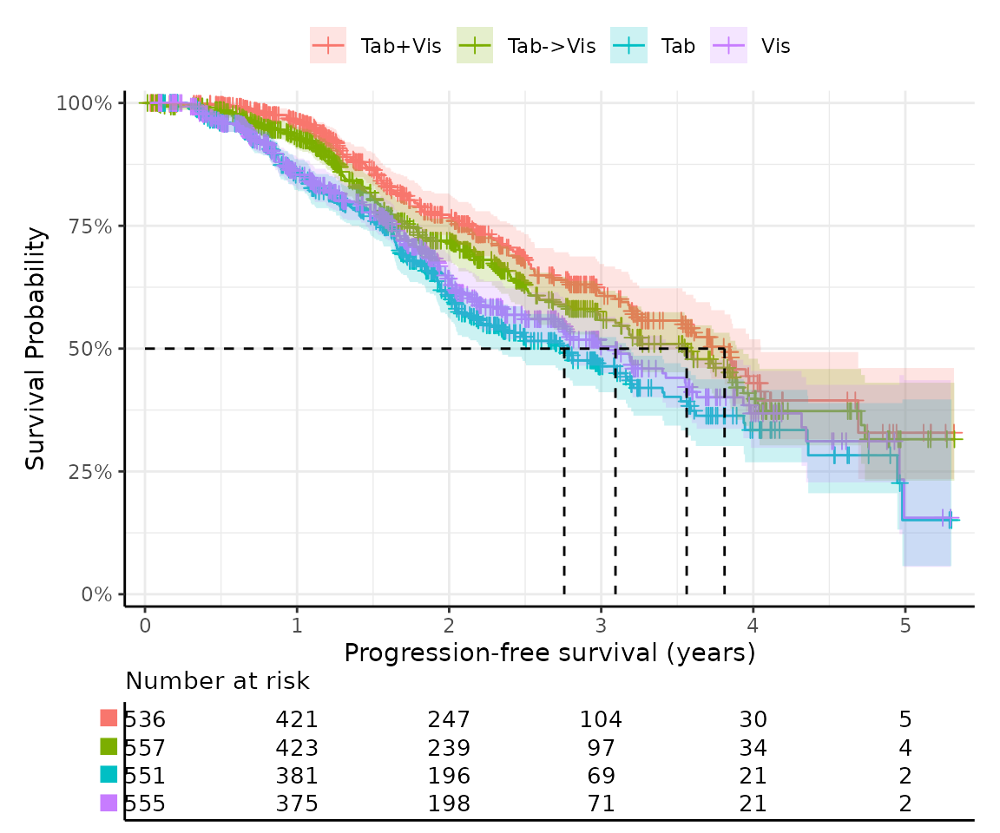

    #> "km_plot" has been printed.
    #> ────────────────────────────────────────────────────────────────────────────────
    #> → For more information, run `View()` on saved `get_km()` output.

This function uses easysurv’s
[`plot_km()`](https://maple-health-group.github.io/easysurv/reference/plot_KM.md)
to generate the KM curves. You can also use
[`plot_km()`](https://maple-health-group.github.io/easysurv/reference/plot_KM.md)
directly, or pass additional arguments to
[`get_km()`](https://maple-health-group.github.io/easysurv/reference/get_KM.md),
to customize the plot.

For example, by default, shapes are used in place of group names in the
risk table beneath the plot to save space. You can change this by
setting `risktable_symbols = FALSE`.

``` r

km_with_names <- get_km(
  data = surv_data,
  time = "time",
  event = "event",
  group = "group",
  risktable_symbols = FALSE
)

km_with_names$km_plot
```

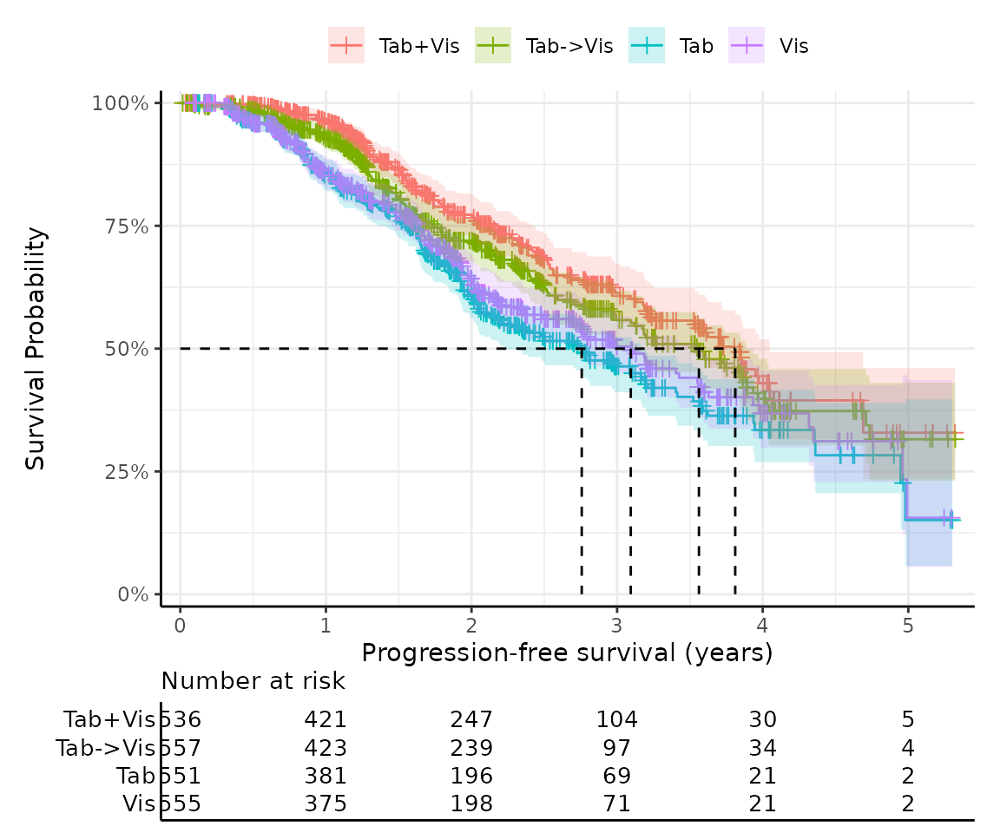

## Testing proportional hazards

The Cox proportional hazards model is a popular method for estimating
the effect of covariates on survival time. The model assumes that the
hazard ratio for a given covariate is constant over time.

`easysurv` provides a simple function,
[`test_ph()`](https://maple-health-group.github.io/easysurv/reference/test_PH.md)
to support testing the proportional hazards assumption.

The output reports the hazard ratios between groups, the 95% confidence
intervals, p-values for the test of survival differences and
proportional hazards.

In this example, the
[`survival::cox.zph()`](https://rdrr.io/pkg/survival/man/cox.zph.html)
found a global p-value of 0.021, suggesting that the proportional
hazards assumption is violated (p \< 0.05).

This is supported by a Schoenfeld residual plot, which shows a clear
pattern of non-proportionality; and a log cumulative hazard plot in
which the lines are not parallel.

However, it is not always clear cut, so a reminder is printed that the
results should be interpreted in totality and with caution.

``` r

ph <- test_ph(
  data = surv_data,
  time = "time",
  event = "event",
  group = "group"
)

ph
#> 
#> ── Testing Survival Curve Differences ──────────────────────────────────────────
#> ℹ `survival::survdiff()` found a p-value of 0.
#> ✔ suggests survival differences between groups are statistically significant.
#> 
#> ── Testing Proportional Hazards Assumption ─────────────────────────────────────
#> 
#> ── Cox Proportional Hazards Model ──
#> 
#> `survival::coxph()` output:
#> 
#>                    coef exp(coef)  se(coef)        z     Pr(>|z|)
#> groupTab->Vis 0.1830613  1.200888 0.1096992 1.668758 9.516544e-02
#> groupTab      0.5033557  1.654263 0.1053908 4.776089 1.787369e-06
#> groupVis      0.4046802  1.498823 0.1074969 3.764574 1.668336e-04
#> 
#> The exp(coef) column shows the hazard ratios were 1.201, 1.654, and 1.499.
#> 
#> ℹ `survival::cox.zph()` found a p-value of 0.021.
#> ! suggests the PH assumption may not be valid.
#> 
#> ── Plots ──
#> 
#> ℹ Schoenfeld residuals and log cumulative hazard plots have been printed.
#> ℹ PH tests may not always agree, so consider the results of all tests and plots in totality.
#> ────────────────────────────────────────────────────────────────────────────────
#> → For more information, run `View()` on saved `test_ph()` output.
```

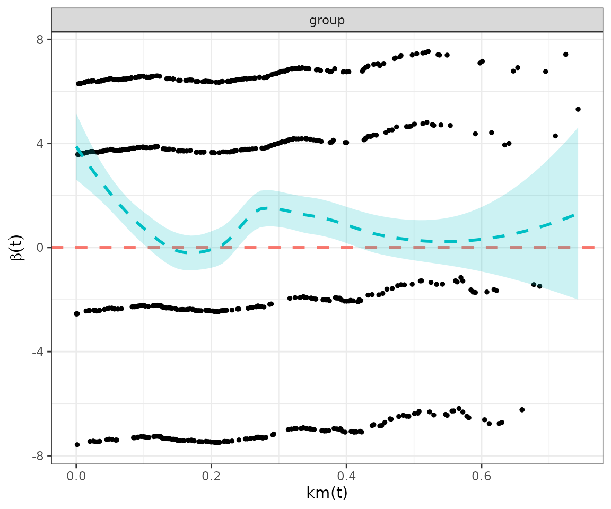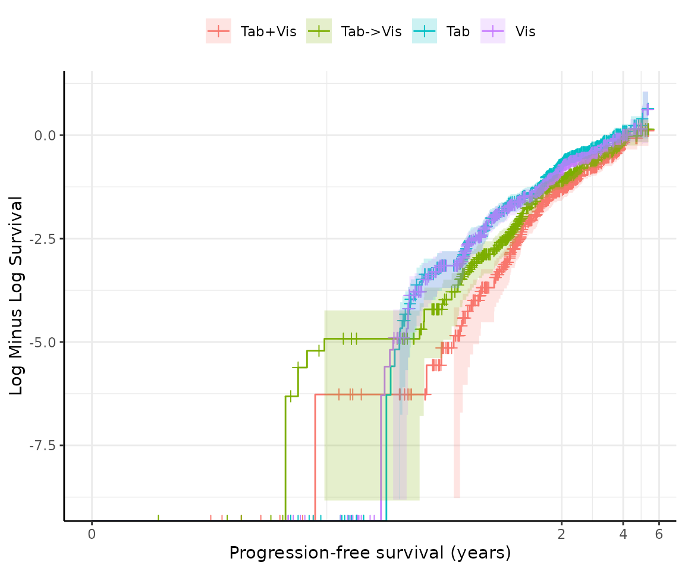

## Fitting survival models

`easysurv` provides a simple function,
[`fit_models()`](https://maple-health-group.github.io/easysurv/reference/fit_models.md)
to fit survival models. This function can fit multiple distributions at
once, and returns a summary of all distributions attempted.

### Aside: handling failure

Under the hood, `easysurv` builds upon the `parsnip` package. Through
[`fit_models()`](https://maple-health-group.github.io/easysurv/reference/fit_models.md),
we make a key update to this approach to handle errors in the model
fitting process.

[`purrr::possibly()`](https://purrr.tidyverse.org/reference/possibly.html)
is leveraged to help code run smoothly even if the model fitting process
fails. This is particularly useful when testing multiple distributions,
as the best distribution is not known *a priori*.

``` r

# We created a function to return NULL if issues arise in model fitting.
pfit <- purrr::possibly(.f = parsnip::fit)

# Without easysurv, here's how parsnip might be used to fit models:
parsnip::survival_reg(dist = "weibull") |>
  parsnip::set_engine("flexsurv") |>
  parsnip::fit(
    formula = survival::Surv(time, event) ~ group,
    data = surv_data
  )

# But, in easysurv, the fit_models() function uses pfit() to handle errors.
# This looks a bit like:
parsnip::survival_reg(dist = "weibull") |>
  parsnip::set_engine("flexsurv") |>
  pfit(
    formula = survival::Surv(time, event) ~ group,
    data = surv_data
  )
```

In the returned object, we track which distributions were attempted,
which were successful, and which failed. Any failures are highlighted
when the fit_models object is printed.

``` r

# Take just two rows of data and expect distributions to fail.
lacking <- surv_data[3:4, ]

suspected_failure <- fit_models(
  data = lacking,
  time = "time",
  event = "event",
  dists = c("exp", "gamma", "gengamma", "gompertz", "llogis", "lnorm", "weibull")
)
#> ! Failed distributions: "lnorm" and "weibull".
print(suspected_failure)
#> 
#> ── Fit Models Summary ──────────────────────────────────────────────────────────
#> Engine: flexsurv.
#> Approach: predict_by_none.
#> • The predict_by argument was not specified.
#> • Therefore, models were fit on the full dataset.
#> 
#> Distributions attempted: "exp", "gamma", "gengamma", "gompertz", "llogis",
#> "lnorm", and "weibull".
#> 
#> ── Median survival estimates ──
#> 
#> ! Some distributions failed to converge.
#> Failed distributions: "lnorm" and "weibull"
#>       dist aic_rank median_est
#> 1      exp        5   2.375962
#> 2    gamma        3   2.316222
#> 3 gengamma        2   2.316587
#> 4 gompertz        4   2.292949
#> 5   llogis        1   2.316222
#> ℹ For comparison, the KM median survival times were 2.316.
#> ℹ The distribution with the best (lowest) AIC was "llogis".
#> ────────────────────────────────────────────────────────────────────────────────
#> → For more information, run `View()` on saved `fit_models()` output.
```

### Fitting models separately

By default,
[`fit_models()`](https://maple-health-group.github.io/easysurv/reference/fit_models.md)
fits the exponential, gamma, generalized gamma, Gompertz, log-logistic,
log-normal, and Weibull distributions using a `flexsurv` engine.

The `predict_by` argument allows you to stratify the analysis by a
factor variable. This is useful for comparing survival curves between
groups.

``` r

models <- fit_models(
  data = surv_data,
  time = "time",
  event = "event",
  predict_by = "group"
)

models
#> 
#> ── Fit Models Summary ──────────────────────────────────────────────────────────
#> Engine: flexsurv.
#> Approach: predict_by_other.
#> • The predict_by argument was set to "group", which was not a covariate.
#> • Therefore, models were fit for each level of "group".
#> • This is sometimes referred to as "separate fits".
#> 
#> Distributions attempted: "exp", "gamma", "gengamma", "gompertz", "llogis",
#> "lnorm", and "weibull".
#> 
#> ── Median survival estimates ──
#> 
#> ── Group: "Tab+Vis"
#>       dist aic_rank median_est
#> 1      exp        7   4.808931
#> 2    gamma        4   3.551551
#> 3 gengamma        2   3.606839
#> 4 gompertz        6   3.704355
#> 5   llogis        3   3.529768
#> 6    lnorm        1   3.640024
#> 7  weibull        5   3.582751
#> ℹ For comparison, the KM median survival time was 3.811.
#> ℹ The distribution with the best (lowest) AIC was "lnorm".
#> 
#> ── Group: "Tab->Vis"
#>       dist aic_rank median_est
#> 1      exp        7   4.050024
#> 2    gamma        2   3.323607
#> 3 gengamma        3   3.340974
#> 4 gompertz        6   3.475535
#> 5   llogis        1   3.289304
#> 6    lnorm        5   3.453536
#> 7  weibull        4   3.344948
#> ℹ For comparison, the KM median survival time was 3.562.
#> ℹ The distribution with the best (lowest) AIC was "llogis".
#> 
#> ── Group: "Tab"
#>       dist aic_rank median_est
#> 1      exp        7   3.042705
#> 2    gamma        4   2.696690
#> 3 gengamma        2   2.684589
#> 4 gompertz        6   2.869834
#> 5   llogis        3   2.642277
#> 6    lnorm        1   2.681792
#> 7  weibull        5   2.743302
#> ℹ For comparison, the KM median survival time was 2.757.
#> ℹ The distribution with the best (lowest) AIC was "lnorm".
#> 
#> ── Group: "Vis"
#>       dist aic_rank median_est
#> 1      exp        7   3.357186
#> 2    gamma        4   2.896536
#> 3 gengamma        2   2.930034
#> 4 gompertz        6   3.062430
#> 5   llogis        3   2.864920
#> 6    lnorm        1   2.918391
#> 7  weibull        5   2.934549
#> ℹ For comparison, the KM median survival time was 3.094.
#> ℹ The distribution with the best (lowest) AIC was "lnorm".
#> ────────────────────────────────────────────────────────────────────────────────
#> → For more information, run `View()` on saved `fit_models()` output.
```

### Fitting models jointly

Alternatively, you can fit all models “jointly” by specifying the
treatment group as a covariate, and also setting `predict_by` to the
treatment group.

This may not be appropriate given the outcomes of the proportional
hazard tests above, but is shown for completeness.

``` r

joint_models <- fit_models(
  data = surv_data,
  time = "time",
  event = "event",
  predict_by = "group",
  covariates = "group"
)

joint_models
#> 
#> ── Fit Models Summary ──────────────────────────────────────────────────────────
#> Engine: flexsurv.
#> Approach: predict_by_covariate.
#> • The predict_by argument was set to "group", which was also a covariate.
#> • Therefore, models were fit on the full dataset.
#> • This is sometimes referred to as "joint fits".
#> 
#> Distributions attempted: "exp", "gamma", "gengamma", "gompertz", "llogis",
#> "lnorm", and "weibull".
#> 
#> ── Median survival estimates ──
#> 
#>       dist aic_rank group=Tab+Vis group=Tab->Vis group=Tab group=Vis
#> 1      exp        7      4.808931       4.050024  3.042705  3.357186
#> 2    gamma        4      3.744443       3.312688  2.679957  2.847226
#> 3 gengamma        1      3.899873       3.341921  2.669066  2.825529
#> 4 gompertz        6      3.816103       3.473659  2.863736  3.042851
#> 5   llogis        3      3.753334       3.280107  2.622821  2.791300
#> 6    lnorm        2      3.968814       3.359080  2.681873  2.832604
#> 7  weibull        5      3.735166       3.347753  2.732276  2.905239
#> ℹ For comparison, the KM median survival times were 3.811, 3.562, 2.757, and 3.094.
#> ℹ The distribution with the best (lowest) AIC was "gengamma".
#> ────────────────────────────────────────────────────────────────────────────────
#> → For more information, run `View()` on saved `fit_models()` output.
```

### Fitting spline models

`easysurv` also supports fitting spline models via a `flexsurvspline`
engine. This is useful when the relationship between time and the hazard
is not linear. The code below fits spline models with 1, 2, and 3 knots
all on the hazard scale.

``` r

spline_models <- fit_models(
  data = surv_data,
  time = "time",
  event = "event",
  predict_by = "group",
  engine = "flexsurvspline",
  k = c(1, 2, 3),
  scale = "hazard"
)
```

### Fitting cure models

`easysurv` also supports fitting mixture cure models via a
`flexsurvcure` engine. This may be useful when a proportion of the
population is assumed to be cured and therefore is much less likely to
experience the event of interest. The code below is an example of the
syntax.

The output for cure models also includes estimated cure fractions.

``` r

cure_models <- fit_models(
  data = surv_data,
  time = "time",
  event = "event",
  predict_by = "group",
  engine = "flexsurvcure"
)
```

## Making predictions and plots

Once you have your
[`fit_models()`](https://maple-health-group.github.io/easysurv/reference/fit_models.md)
object, you can use
[`predict_and_plot()`](https://maple-health-group.github.io/easysurv/reference/predict_and_plot.md)
to generate predictions and plots that may help you choose between
models.

The
[`predict_and_plot()`](https://maple-health-group.github.io/easysurv/reference/predict_and_plot.md)
function generates survival and hazard plots for each model, stratified
by the `predict_by` variable from the original
[`fit_models()`](https://maple-health-group.github.io/easysurv/reference/fit_models.md)
call (if `predict_by` was provided).

If you don’t provide a `times` argument, the function will predict up to
5 times the maximum observed time in the data, at 100 equally
distributed time points, which is often sufficient.

``` r

# With the "models" object from above...
preds_and_plots <- predict_and_plot(models)

preds_and_plots
#> ℹ Survival plots have been printed.
#> ℹ Hazard plots have been printed.
```

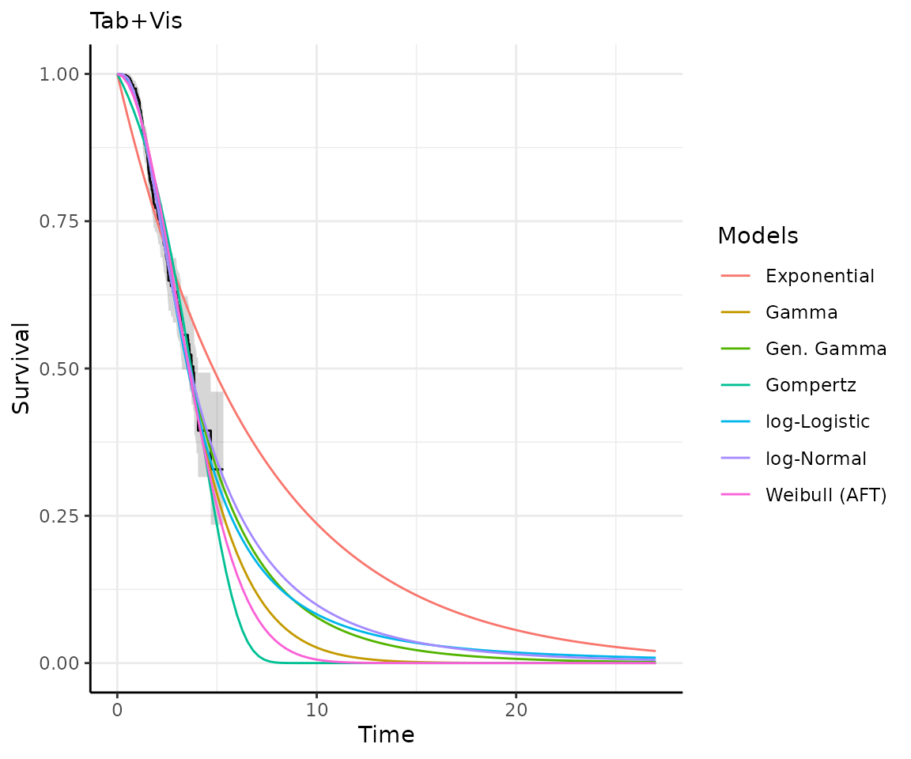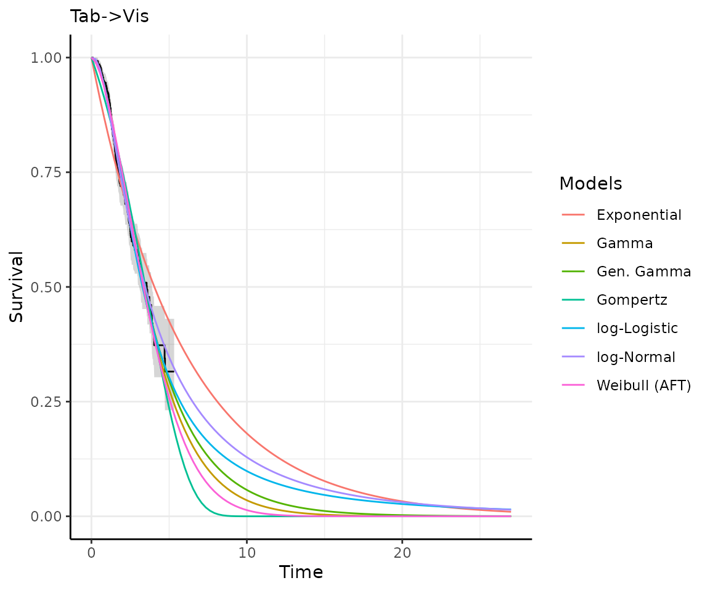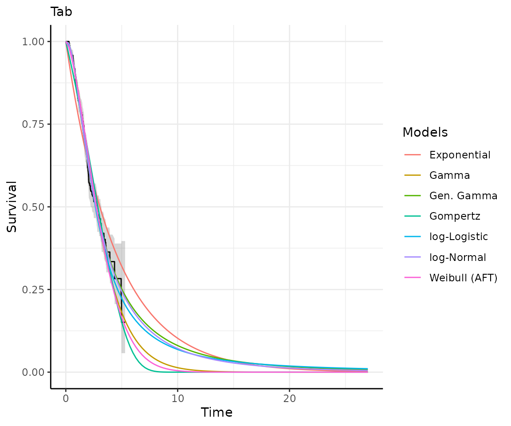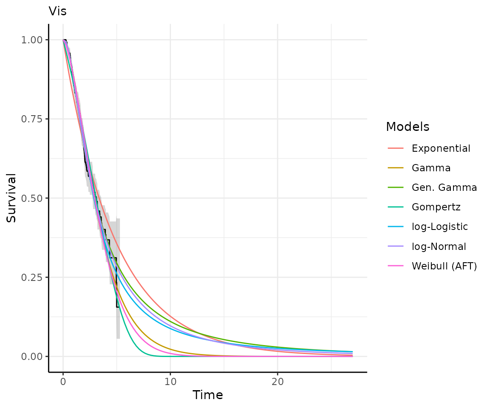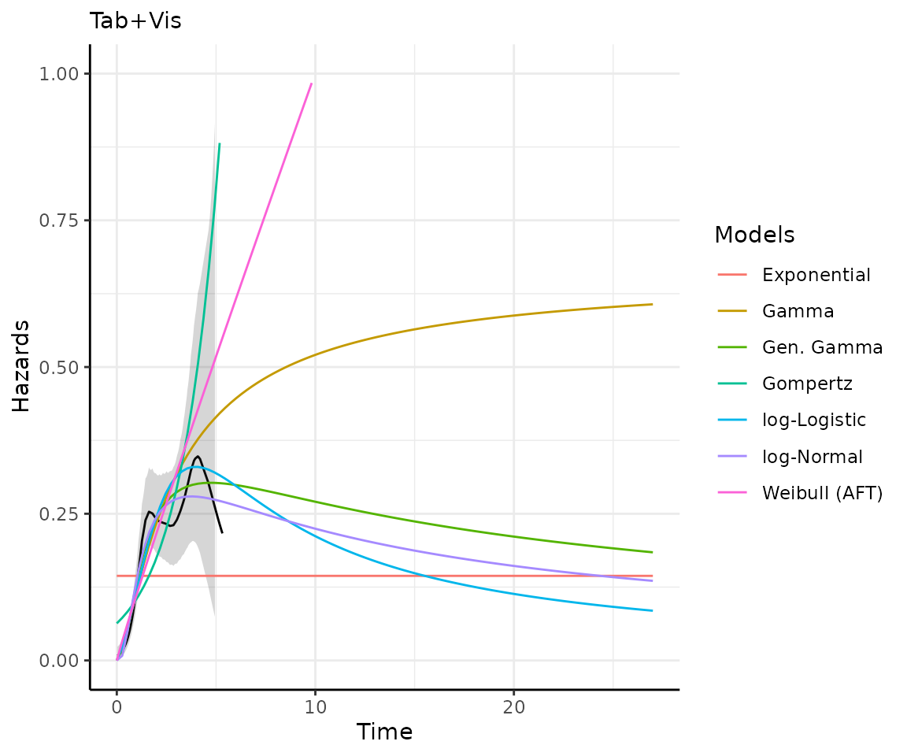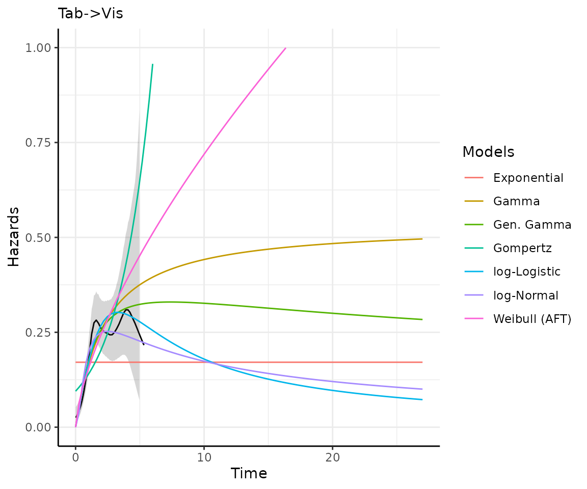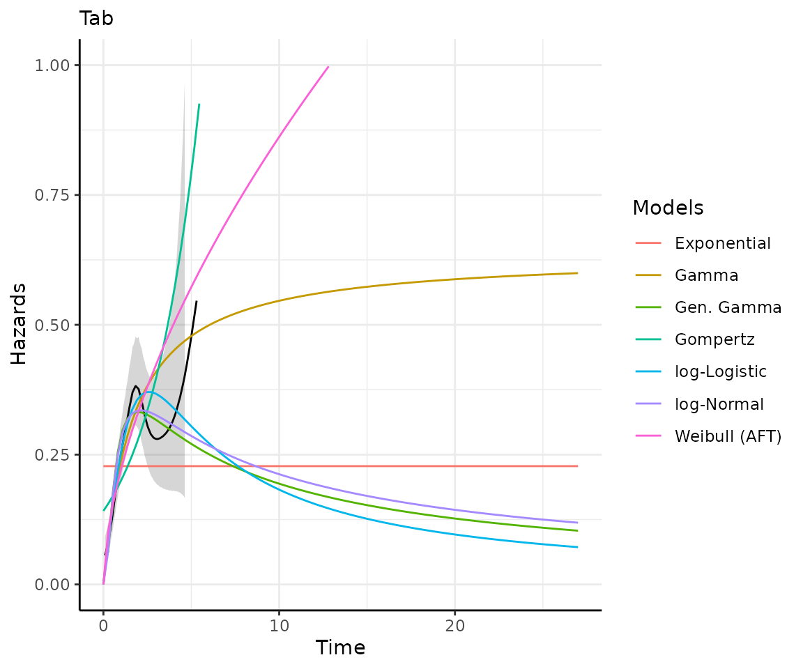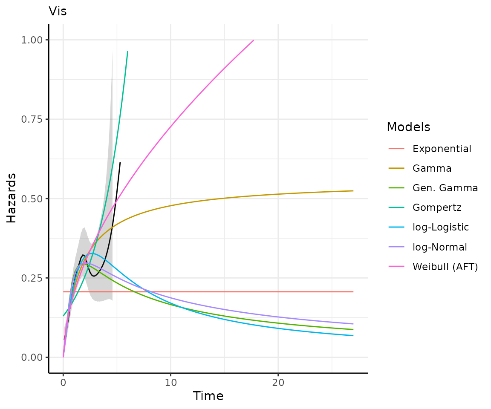

## Exporting your results

`easysurv` provides a simple function,
[`write_to_xl()`](https://maple-health-group.github.io/easysurv/reference/write_to_xl.md)
to export your results to a .xlsx file, using the `openxlsx` package.

The function can take outputs from
[`get_km()`](https://maple-health-group.github.io/easysurv/reference/get_KM.md),
[`test_ph()`](https://maple-health-group.github.io/easysurv/reference/test_PH.md),
[`fit_models()`](https://maple-health-group.github.io/easysurv/reference/fit_models.md),
and
[`predict_and_plot()`](https://maple-health-group.github.io/easysurv/reference/predict_and_plot.md).

For example, you can export the outputs from the above code chunks to an
Excel file with the following code:

``` r

# Create workbook
wb <- openxlsx::createWorkbook()

# Write easysurv objects to the workbook
write_to_xl(wb, km)
write_to_xl(wb, ph)
write_to_xl(wb, models)
write_to_xl(wb, preds_and_plots)

# Save and open the workbook
openxlsx::saveWorkbook(wb, file = "my_file_name.xlsx", overwrite = TRUE)
openxlsx::openXL("my_file_name.xlsx")
```

Note: if you have multiple `fit_models` or `predict_and_plot` objects,
you should save these to other workbooks, since
[`write_to_xl()`](https://maple-health-group.github.io/easysurv/reference/write_to_xl.md)
may choose the same sheet names and overwrite data from other models.

## Conclusion

And with that, we have a set of standard parametric model outputs in
both R and Excel!

We hope you enjoy using the package!
