# easysurv

The `easysurv` R package provides tools to simplify survival data
analysis and model fitting.

This includes tools to inspect survival data, plot Kaplan-Meier curves,
assess the proportional hazards assumption, fit parametric survival
models, predict and plot survival and hazards, and export the outputs to
Excel.

For fitting survival models, the package provides a simple interface to
[`flexsurv::flexsurvreg()`](http://chjackson.github.io/flexsurv-dev/reference/flexsurvreg.md),
[`flexsurv::flexsurvspline()`](http://chjackson.github.io/flexsurv-dev/reference/flexsurvspline.md),
[`flexsurvcure::flexsurvcure()`](https://rdrr.io/pkg/flexsurvcure/man/flexsurvcure.html),
and
[`survival::survreg()`](https://rdrr.io/pkg/survival/man/survreg.html).

By default, the package uses the `flexsurv` engine
([`flexsurv::flexsurvreg()`](http://chjackson.github.io/flexsurv-dev/reference/flexsurvreg.md))
and provides a helpful starting point to explore survival extrapolations
across frequently used distributions (such as exponential, generalized
gamma, gamma, Gompertz, log-logistic, log-normal and Weibull).

## Installation

If you haven’t already, install [R](https://www.r-project.org) and
consider using an integrated development environment (IDE) such as
[RStudio](https://posit.co/products/open-source/rstudio) or
[Positron](https://positron.posit.co).

``` r

# You will need to have the pak package installed.
install.packages("pak")

# Then, install easysurv either from GitHub for the latest version:
pak::pkg_install("Maple-Health-Group/easysurv")

# Or from CRAN for the latest stable version:
pak::pkg_install("easysurv")
```

## Getting started

``` r

# Attach the easysurv library
library(easysurv)

# Open an example script
quick_start()
## Note: The default file name is "easysurv_start.R", but you can define your own, e.g.
## quick_start("my_file_name.R")

# Access help files
help(package = "easysurv")
```

## Examples

### Start by tidying your data…

``` r

# Load the easy_lung data from the easysurv package
# Recode the "status" variable to create an event indicator (0/1)
surv_data <- easy_lung |>
  dplyr::mutate(
    time = time,
    event = status - 1,
    group = sex,
    .after = time
  ) |>
  dplyr::select(-c(inst, ph.karno, pat.karno)) # remove some unused columns

# Make the group variable a factor and assign level labels.
surv_data <- surv_data |>
  dplyr::mutate_at("group", as.factor)
levels(surv_data$group) <- c("Male", "Female")
```

### … then enjoy the easysurv functions!

### `inspect_surv_data()`

``` r

inspect_surv_data(
  data = surv_data,
  time = "time",
  event = "event",
  group = "group"
)
```

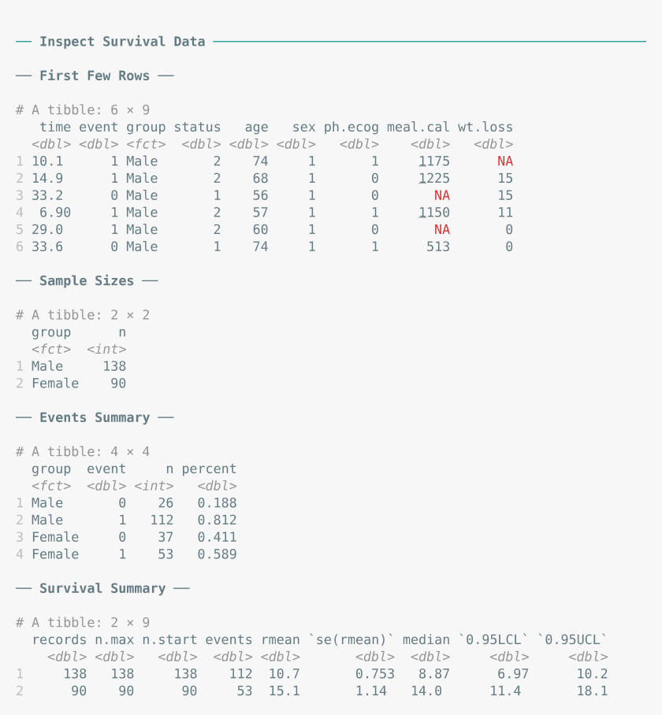

### `get_km()`

``` r

km_check <- get_km(
  data = surv_data,
  time = "time",
  event = "event",
  group = "group"
)

print(km_check)
```

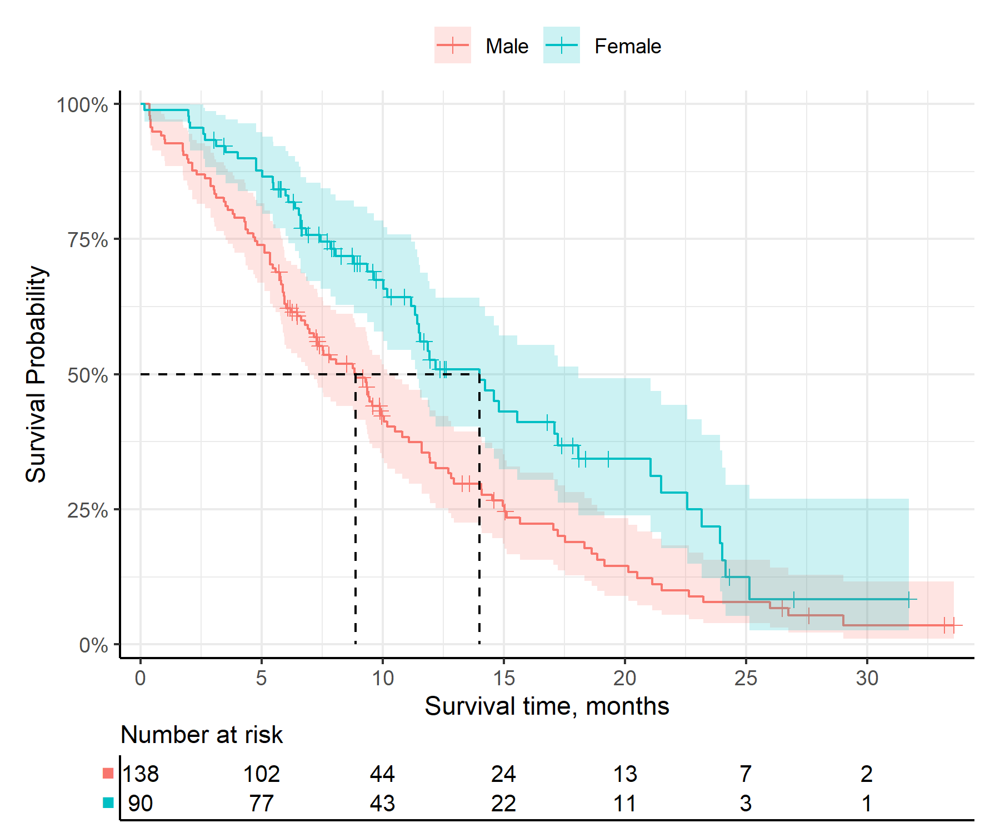

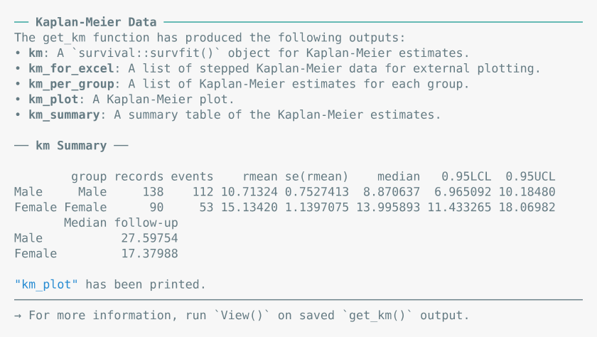

### `test_ph()`

``` r

ph_check <- test_ph(
  data = surv_data,
  time = "time",
  event = "event",
  group = "group"
)

print(ph_check)
```

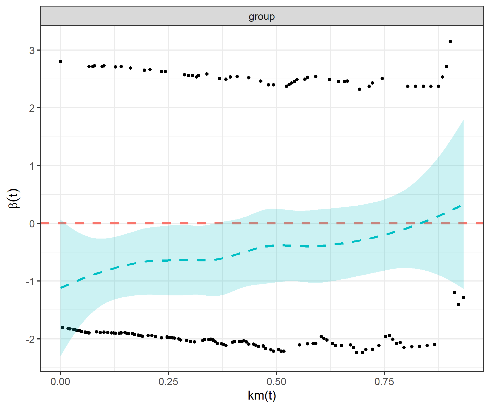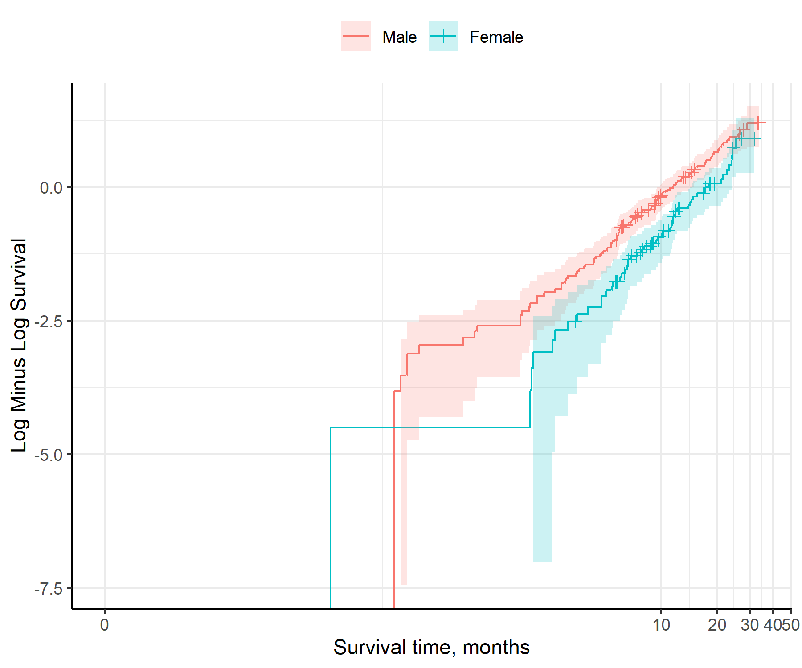

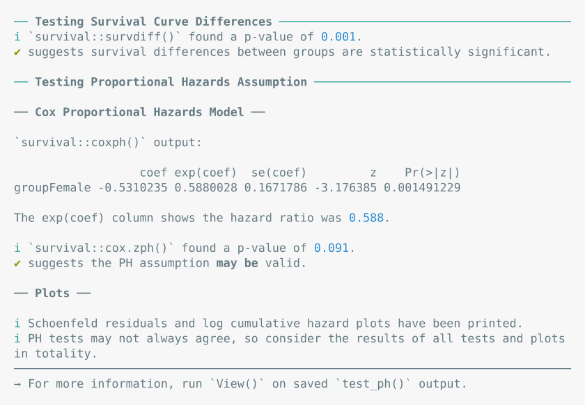

### `fit_models()`

``` r

separate_models <- fit_models(
  data = surv_data,
  time = "time",
  event = "event",
  predict_by = "group"
)

print(separate_models)
```

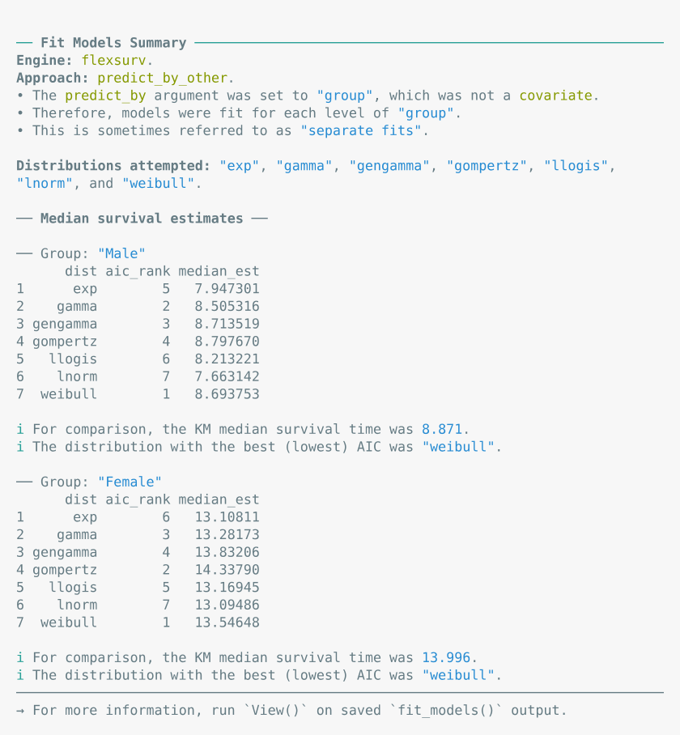

### `predict_and_plot()`

``` r

plots <- predict_and_plot(fit_models = separate_models)

print(plots)
```

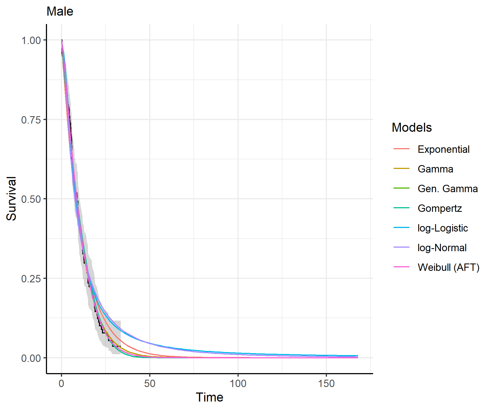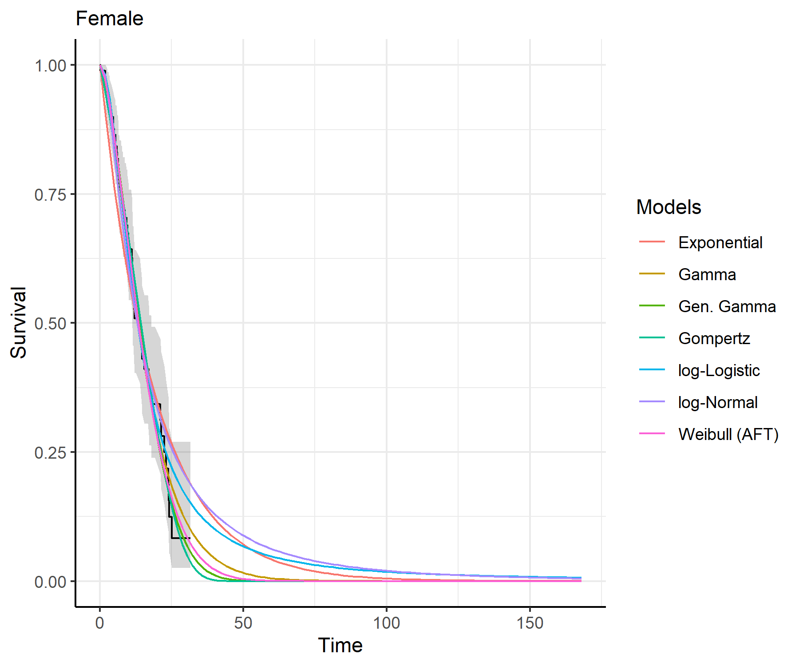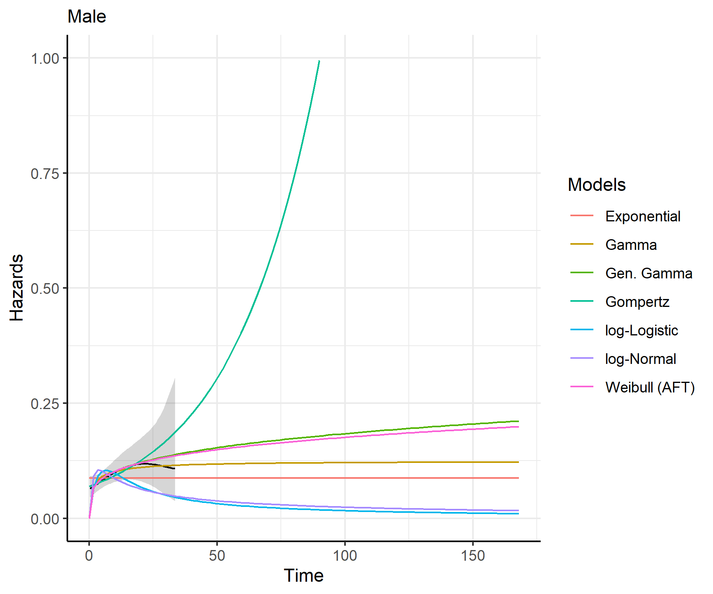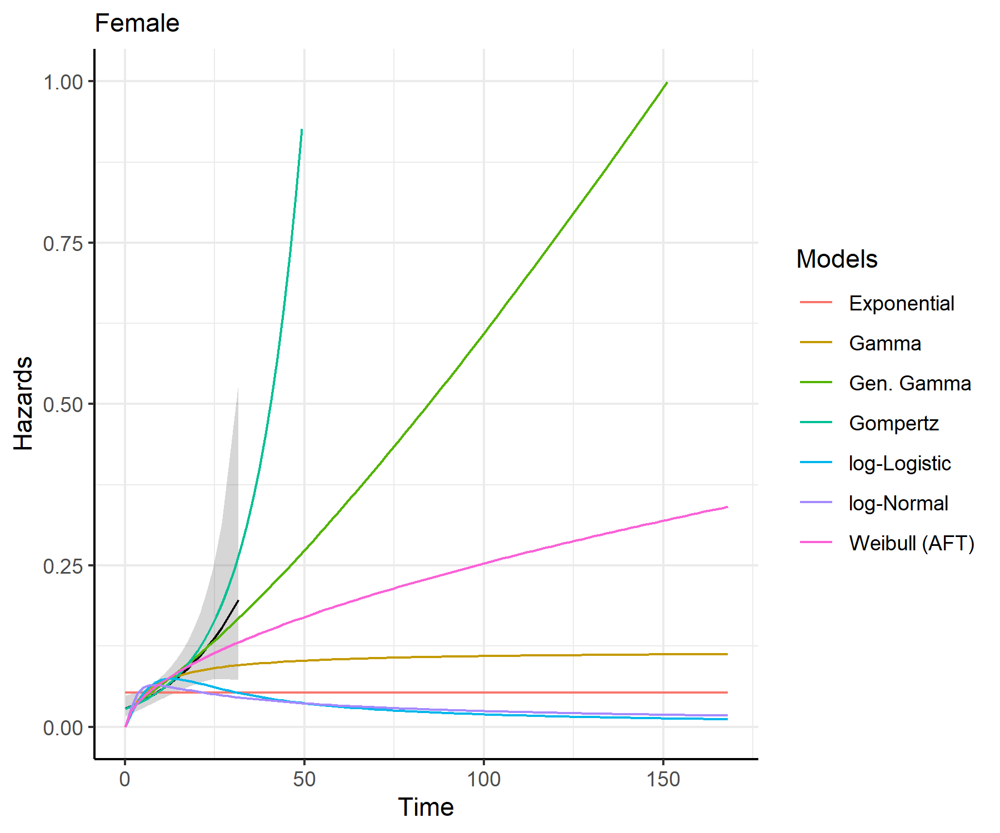


